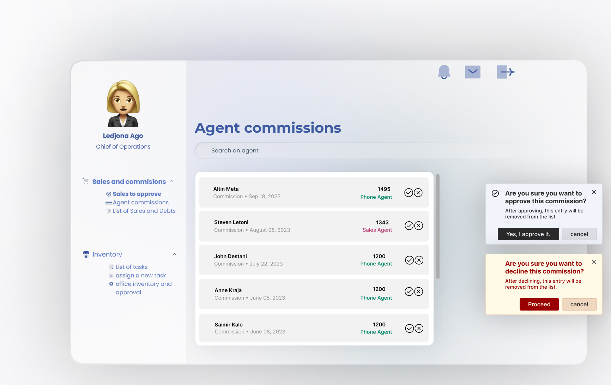

# Water Filter System Client
This README provides an overview of the system's features, user roles, and functionality. Let's dive in! 🚀

## Table of Contents
1. [Overview](#overview)
2. [Features](#features)
   - [Sales Agent Dashboard](#sales-agent-dashboard)
   - [Phone Agent Dashboard](#phone-agent-dashboard)
   - [Marketing Manager Dashboard](#marketing-manager-dashboard)
   - [Chief of Operations Dashboard](#chief-of-operations-dashboard)
3. [User Roles](#user-roles)
4. [System Requirements](#system-requirements)
5. [Installation](#installation)
6. [Usage](#usage)
7. [FAQ](#faq)

## Overview
This system is designed to streamline the sales, scheduling, and management processes for a water filter company. It includes various dashboards tailored for different roles within the organization, ensuring efficient operations and effective communication.

## Features

### Sales Agent Dashboard
- **Schedule Management**: Set up and view work schedules for the next seven days. ⏰
- **Meeting Overview**: Access daily and weekly meetings. 📅
- **Reference Management**: Add new references and manage existing ones. 👥
- **Instant Meeting Setup**: Arrange express meetings without prior scheduling. ⚡
- **Meeting Logging**: Log outcomes of daily meetings. 📝
- **Referral Commission**: Earn commissions for new referrals and successful meetings. 💸

### Phone Agent Dashboard
- **View Sales Agents' Schedules**: Check schedules for the upcoming seven days. 📆
- **Latest References Management**: Manage and update latest references. 🔄
- **Call History**: Track daily call activities. 📞
- **Make Calls**: Input phone numbers and schedule future calls or meetings. ☎️
- **Meeting Setup**: Schedule meetings with sales agents based on client availability. 🗓️
- **Reserved Phone Calls**: Manage pending phone calls. 📋

### Marketing Manager Dashboard
- **Reserved Phone Call Management**: Allocate and manage reserved calls. 📲
- **Agent Schedule Management**: Adjust sales agents' schedules. 🔧
- **View Agent Schedules**: Check schedules for planning and coordination. 🗒️
- **Phone and Sales Agent Statistics**: Access detailed statistics and performance metrics. 📊
- **Meeting and Call Details**: Review client interaction details. 🕵️‍♂️
- **Reference Overview**: Manage and edit reference details. 📝
- **Red List Management**: Handle the "Red List" of clients. 🚫
- **Buyer and Reference Lists**: Quick access to important lists. 📂

### Chief of Operations Dashboard
- **Sales Approval**: Review and approve sales. ✅
- **Commission Structure**: Manage SPIF commissions and tiered sales commissions. 💰
- **Financial Reports**: Access comprehensive financial reports. 📑
- **Installation Scheduling**: Schedule water filter installations. 🛠️
- **Sales and Debt Lists**: View detailed lists of sales and debts. 📋
- **Debt Collection Setup**: Assign debt collection tasks. 💼
- **Installer Management**: Efficiently manage installer tasks. 👷‍♂️
- **Office Inventory Management**: Maintain and approve inventory requests. 📦

## User Roles
- **Sales Agents**: Handle client meetings, manage schedules, and log meeting outcomes.
- **Phone Agents**: Manage references, make calls, and set up meetings.
- **Marketing Manager**: Oversee sales and phone agents, manage schedules, and handle reference details.
- **Chief of Operations**: Approve sales, manage commissions, schedule installations, and oversee inventory.
- 

## Mockups
Here are some mockups of the system's user interface, showcasing different dashboards and features:

## Mockups
Here are some mockups of the system's user interface, showcasing different dashboards and features:

<table>
  <tr>
    <td></td>
    <td></td>
  </tr>
  <tr>
    <td></td>
    <td></td>
  </tr>
  <tr>
    <td></td>
    <td></td>
  </tr>
  <tr>
    <td></td>
    <td></td>
  </tr>
  <tr>
    <td></td>
    <td></td>
  </tr>
  <tr>
    <td></td>
    <td></td>
  </tr>
</table>

<table>
  <tr>
    <td></td>
    <td></td>
  </tr>
  <tr>
    <td></td>
    <td></td>
  </tr>
  <tr>
    <td></td>
    <td></td>
  </tr>
  <tr>
    <td></td>
    <td></td>
  </tr>
  <tr>
    <td></td>
    <td></td>
  </tr>
  <tr>
    <td></td>
    <td></td>
  </tr>
  <tr>
    <td></td>
    <td></td>
  </tr>
  <tr>
    <td></td>
    <td></td>
  </tr>
  <tr>
    <td></td>
    <td></td>
  </tr>
  <tr>
    <td></td>
    <td></td>
  </tr>
  <tr>
    <td></td>
    <td></td>
  </tr>
  <tr>
    <td></td>
    <td></td>
  </tr>
  <tr>
    <td></td>
  </tr>
</table>

## System Requirements
- **Hardware**: Standard computer with internet access.
- **Software**: Web browser, PDF viewer.

## Installation
1. Clone the repository: `git clone https://github.com/yourusername/water-filter-system.git`
2. Navigate to the project directory: `cd water-filter-system`
3. Install dependencies: `npm i`
4. Start the application: `npm start`

## Usage
1. Log in with your role-specific credentials.
2. Access the respective dashboard.
3. Utilize the features as described in the [Features](#features) section.

## FAQ
**Q: How do sales agents decide their schedules?**
A: Sales agents can set their own schedules for the next seven days.

**Q: What information should phone operators collect?**
A: Collect standard personal information, correct address, and comments for successful meetings.

**Q: Is there a commission cap for agents?**
A: No, there is no cap on commissions.

For more FAQs, refer to the [FAQ section](FAQ.md) in the repository.

---

Happy filtering! 💧✨
